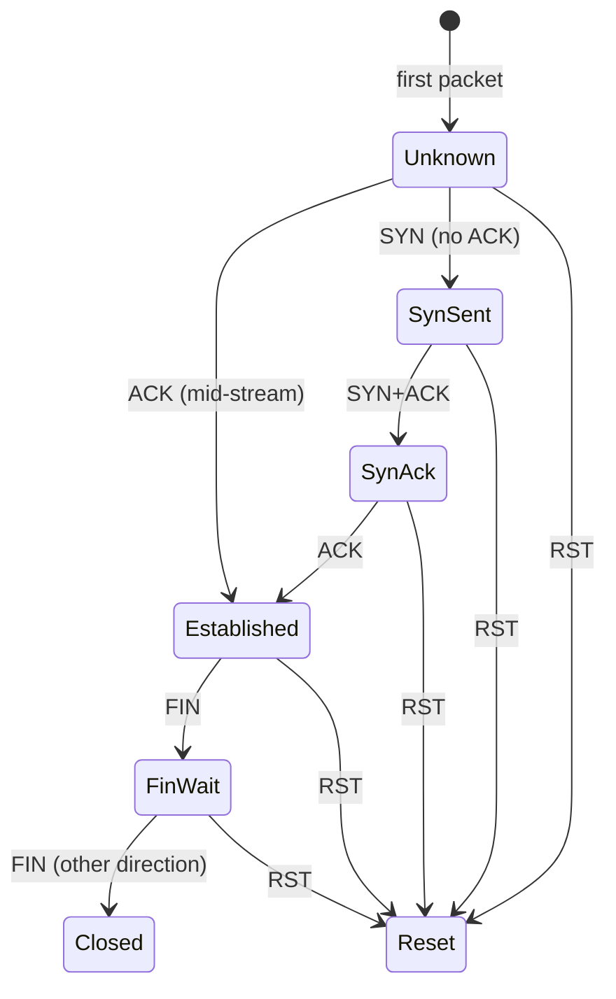

# Flow Tracking

NetScope tracks bidirectional network flows -- conversations between two endpoints identified by protocol, IP addresses, and ports.

## Flow Keys

Flows are identified by a canonical bidirectional key:

```
(protocol, endpoint_a, endpoint_b)
```

Where each endpoint is `(ip, port)` and endpoints are ordered deterministically (the "smaller" endpoint by `(ip_version, ip_bytes, port)` is always endpoint A). This means packets in both directions of a conversation map to the same flow entry.

Only TCP and UDP flows are tracked. ICMP and other protocols are parsed but do not create flow entries.

## Per-Flow Data

Each flow tracks:

| Field | Description |
|---|---|
| `first_seen` / `last_seen` | Timestamps of the first and most recent packet. |
| `packets_a_to_b` / `packets_b_to_a` | Packet counts in each direction. |
| `bytes_a_to_b` / `bytes_b_to_a` | Byte counts in each direction (wire length). |
| `tcp_state` | Current TCP connection state (TCP flows only). |
| `client` | Which side initiated the connection (sent the first SYN). |
| `retransmissions` | Number of detected TCP retransmissions. |
| `out_of_order` | Number of detected out-of-order TCP segments. |
| `rtt_last_ms` | Most recent RTT sample (milliseconds). |
| `rtt_min_ms` | Minimum observed RTT. |
| `rtt_ewma_ms` | Exponentially weighted moving average RTT (alpha = 0.125). |
| `rtt_samples` | Number of RTT samples collected. |

## TCP State Machine

For TCP flows, NetScope tracks connection state based on observed flags:



The first SYN observed determines the "client" direction. Mid-stream captures (where the SYN was missed) transition directly to `Established` on the first ACK.

## RTT Estimation

RTT is estimated by tracking TCP sequence numbers:

1. When a segment with new data is sent, its sequence end and timestamp are recorded.
2. When an ACK covering that sequence is received from the other side, the RTT sample is `ack_time - send_time`.
3. The EWMA is updated: `rtt_ewma = 0.875 * rtt_ewma + 0.125 * sample`.

Up to 128 in-flight sequence samples are tracked per direction. RTT estimation is enabled by default and can be disabled with `analysis.rtt = false`.

## Retransmission Detection

A segment is classified as a retransmission when its sequence end does not advance past the highest seen sequence number AND its data falls at or before the last acknowledged byte from the peer. This distinguishes retransmissions from out-of-order segments:

- **Retransmission**: `seq_end <= peer_last_ack` (data already acknowledged).
- **Out-of-order**: `seq_end <= max_seq_end` but `seq_end > peer_last_ack` (data not yet acknowledged, just arriving late).

Both counters are per-flow (not per-direction). Detection is enabled by default and can be disabled with `analysis.retrans = false` / `analysis.out_of_order = false`.

## Flow Expiration

Flows are expired based on inactivity:

- **Timeout**: Flows with no packets for `flow.timeout_secs` (default: 60s) are removed. Set to 0 to disable.
- **Max flows**: When the flow table exceeds `flow.max_flows` (default: 100,000), the oldest flows by `last_seen` are evicted.

Expiration is checked once per second during packet processing.

## Top Flows

The `--top-flows N` option (or `stats.top_flows` in config) reports the N flows with the highest byte delta since the last stats tick. This uses a partial selection algorithm (`select_nth_unstable_by`) for O(F) performance instead of sorting the entire flow table.

Each stats tick resets the delta counters **only for the reported top-N flows**. Flows outside the top-N continue accumulating their delta. This means if a flow spikes briefly and drops off the top-N, its delta carries forward and may cause it to appear with a higher rate when it next enters the top-N.

## Configuration Summary

| Key | Default | Description |
|---|---|---|
| `flow.timeout_secs` | `60.0` | Inactivity timeout. |
| `flow.max_flows` | `100000` | Maximum tracked flows. |
| `analysis.rtt` | `true` | Enable RTT estimation. |
| `analysis.retrans` | `true` | Enable retransmission detection. |
| `analysis.out_of_order` | `true` | Enable out-of-order detection. |
| `stats.top_flows` | `0` | Top-N flows per stats tick. |
