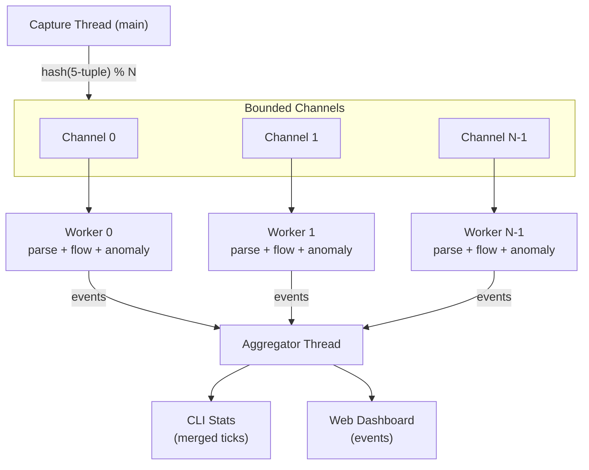

# Sharded Pipeline

When enabled (`--pipeline`), NetScope splits packet processing across multiple worker threads for higher throughput on multi-core machines. The capture thread does minimal work -- it reads packets from libpcap, computes a fast 5-tuple hash from raw bytes, and dispatches each packet to the appropriate shard via bounded crossbeam channels.

```bash
sudo netscope --pipeline --quiet --stats --top-flows 5
```

## Architecture



### How It Works

1. **Capture thread** reads raw packets from libpcap on the main thread.
2. **Shard routing** extracts the 5-tuple (protocol, src IP, src port, dst IP, dst port) from raw bytes at fixed offsets -- no full parse required. The hash determines which worker receives the packet: `shard = hash(5-tuple) % num_workers`.
3. **Workers** each own their own `FlowTracker` and `AnomalyDetector`. Parsing, flow tracking, TCP analysis, and anomaly detection all happen lock-free within each shard.
4. **Aggregator** collects per-shard tick data, merges it into global statistics, and forwards events to the CLI and web dashboard.

All packets for the same 5-tuple always land on the same shard, guaranteeing correctness for flow tracking and TCP state machines.

### Canonical Ordering

Shard routing uses canonical endpoint ordering (always hashing `(min, max)` regardless of packet direction) so that both directions of a flow map to the same shard.

## Configuration

| Key | Default | Description |
|---|---|---|
| `workers` | `0` (auto) | Number of worker shards. Auto mode uses half of CPU count, clamped to 1..8. |
| `channel_capacity` | `4096` | Per-shard bounded channel size. When a channel is full, the packet is dropped and counted as a "dispatch drop". |

Set in the `[pipeline]` section of the config file, or via `--pipeline` / `--workers` CLI flags.

## Dispatch Drops

When a worker's channel is full, the capture thread drops the packet rather than blocking. This prevents the capture thread from stalling (which would cause kernel-level drops). Dispatch drops are counted and printed at capture exit:

```
Capture complete (pipeline mode).
  Packets captured:  1000000
  Dispatch drops:    42
```

If you see significant dispatch drops, consider:

- Increasing `channel_capacity` (at the cost of more memory).
- Increasing `workers` to spread the load.
- Applying a BPF filter to reduce total packet volume.

## Worker Tick Merging

Each worker emits a partial tick containing its byte/packet counts and top flows. The aggregator waits for all N shards to report before merging into a single global tick. This means:

- Stats reflect all shards combined.
- Top flows are merged across shards and re-sorted globally.
- The tick interval is effectively paced by the slowest shard.

The aggregator enforces a minimum tick interval of 500ms per worker to prevent excessive event throughput.

## Shutdown Behavior

On Ctrl-C:

1. The capture thread stops reading and drops all shard channel senders.
2. Each worker drains its remaining channel, emits a final tick, and sends a `Shutdown` event containing its complete flow snapshot.
3. The aggregator collects all shard snapshots and merges them for flow export.

Flow exports (`--export-json`, `--export-csv`) in pipeline mode contain the merged snapshot from all shards.

## Known Caveats

### Anomaly detection thresholds are per-shard

Each worker shard has its own `AnomalyDetector` instance. Since traffic for different source IPs can land on different shards, detection thresholds (e.g., SYN flood `syn_threshold = 200`) are evaluated per-shard, not globally. This means:

- A distributed SYN flood spread across all shards may not trigger alerts if each shard sees fewer SYNs than the threshold individually.
- Port scans that hit many destinations will distribute across shards, reducing per-shard counts.
- Attacks targeting a single destination (which routes to one shard) are detected normally.

In practice, this means pipeline mode is less sensitive to anomalies than inline mode when traffic is widely distributed. If precise anomaly detection is critical, consider using inline mode or lowering thresholds proportionally.

### `max_flows` is per-shard

The configured `max_flows` limit applies to each worker independently. With 4 workers and `max_flows = 100000`, the effective global limit is 400,000 flows. This means pipeline mode can use more memory for flow tracking than the configured value suggests.

### No per-packet CLI output

Pipeline mode does not support per-packet terminal output (`--quiet` is effectively always on for the packet display). Stats and the web dashboard work normally.

### Pcap writing

Pcap file writing (`--write-pcap`) still happens on the capture thread before dispatch, so all packets are written regardless of dispatch drops.
