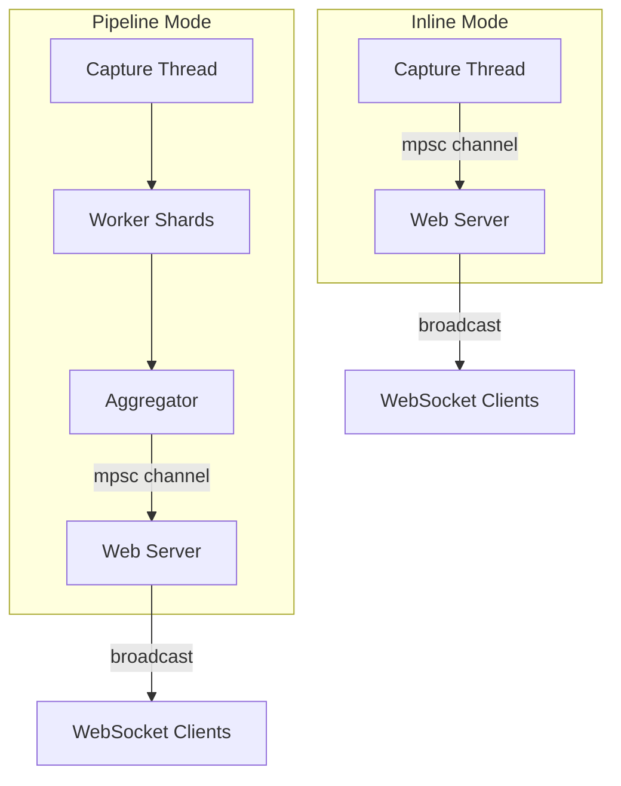

# Web Dashboard

The web dashboard provides a real-time browser interface for monitoring captured traffic. Enable it with `--web` or `[web] enabled = true` in the config file.

```bash
sudo netscope --web --quiet
```

Then open <http://127.0.0.1:8080>.

## Features

- **Stats cards** -- live throughput (Mbps), packet rate (pps), active flow count, and alert count.
- **Time-series chart** -- dual-axis throughput and packet rate history (Chart.js, last 120 data points).
- **Top flows table** -- ranked by throughput delta per tick, showing protocol, endpoints, rate, total bytes, and TCP state.
- **Packet list** -- sampled packets displayed in real time, newest at top.
- **Packet inspector** -- click any packet to see the full protocol tree (Ethernet, IP, TCP/UDP/ICMP fields) and hex dump, fetched on demand from the server.
- **Alerts tab** -- real-time anomaly alerts (SYN flood, port scan).
- **Auto-reconnect** -- the WebSocket reconnects automatically after disconnection (2-second retry).

## Endpoints

| Path | Method | Description |
|---|---|---|
| `/` | GET | Serves the dashboard HTML (embedded in the binary via `rust-embed`). |
| `/ws` | GET | WebSocket endpoint for real-time data. |
| `/api/health` | GET | Health check, returns `200 OK`. |

The frontend is embedded into the binary at compile time -- no external files or build steps are needed.

## Architecture



In both modes, the web server runs in a dedicated thread with its own tokio runtime. It receives events through an `mpsc` channel (capacity 4096) and broadcasts them to all connected WebSocket clients.

### Event Types

The server sends JSON messages to clients, each with a `"type"` field:

| Type | Description |
|---|---|
| `hello` | Sent on connect. Contains `version` and `tick_ms`. |
| `stats_tick` | Periodic aggregate statistics (throughput, pps, active flows, top flows). |
| `packet_sample` | A sampled packet summary (id, timestamp, protocol, src, dst, info). |
| `packet_detail` | Full protocol tree and hex dump for a specific packet (requested by client). |
| `alert` | Anomaly alert (timestamp, kind, description). |

Clients can request packet details by sending:

```json
{ "type": "get_packet_detail", "id": 42 }
```

The server looks up the packet in its ring buffer and responds with a `packet_detail` message.

## Configuration

| Key | Default | Description |
|---|---|---|
| `tick_ms` | `1000` | How often stats are pushed to clients (milliseconds). |
| `top_n` | `10` | Number of top flows included in each stats tick. |
| `packet_buffer` | `2000` | Ring buffer size for packet detail lookups. Only the most recent N packets are retained. |
| `sample_rate` | `1` | Send every Nth packet to the UI. Set to 0 to disable the live packet feed. Increase this at high capture rates to reduce browser load. |
| `payload_bytes` | `256` | Maximum raw bytes stored per packet for hex dump display. |

These can be set in the `[web]` section of the config file. `--web-bind` and `--web-port` are available as CLI flags; the other keys require a config file.

## Tuning for High Traffic

At high capture rates, the event channel (capacity 4096) applies backpressure. Dropped events are logged at TRACE level (`-vvv`). To reduce load:

1. **Increase `sample_rate`** -- e.g., set to `10` to send only every 10th packet to the UI.
2. **Reduce `top_n`** -- fewer flows per tick means less data serialized per tick.
3. **Increase `tick_ms`** -- less frequent updates reduce WebSocket bandwidth.
4. **Reduce `payload_bytes`** -- smaller hex dumps stored per packet.

## Security

The web server binds to `127.0.0.1` by default. Since NetScope typically runs as root, exposing the dashboard to the network (`--web-bind 0.0.0.0`) should be done with care -- it serves real-time traffic data with no authentication.
